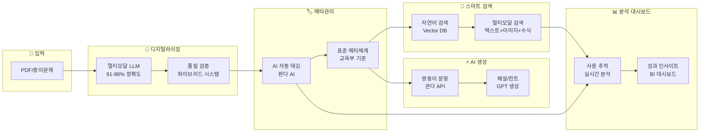

# 문제은행 플랫폼 - AI 기반 통합 서비스
> **사업기획 PT용 서비스 중심 기획서**  
> 작성일: 2025-09-11  
> 최신 요구사항 반영: 25-09-11 문제은행 상위 요건정리  

---

## 🎯 **서비스 비전 & 핵심 가치**

### 🚀 **One-Stop 문제은행 플랫폼**
**"오프라인 문제를 AI로 디지털화하고, 모든 브랜드가 공유하는 스마트 문제은행"**

### 핵심 차별점
1. **문제 특화 전문 플랫폼**: 문제 콘텐츠만을 위한 전용 
 2. **AI 최적화 운영**: 자동 태깅, 스마트 검색, 유사 문제 탐지
3. **사용성 추적 분석**: 문제별 사용 이력 및 성과 대시보드
4. **표준화된 메타체계**: 교육부 기준 표준 메타데이터 적용
### 💡 **상위 담당자 어필 포인트**
1. **즉시 수익 창출**: 기존 오프라인 자산을 온라인 서비스로 전환
2. **운영비 대폭 절감**: 사람 작업 대비 60-70% 비용 절감 (검증 완료)
3. **신규 사업 기반**: AI 기반 교육 서비스의 핵심 인프라 구축
4. **시장 선점 기회**: 국내 유일의 AI 네이티브 문제은행 플랫폼

---

## 📊 **현재 상황 & 기회**

### 🏢 **CBS 현황**
- 브랜드별로 분산된 문제 관리 → **통합 필요**
- 오프라인 PDF 자산 대량 보유 → **디지털화 필요** 
- 수동 태깅 및 검색 → **AI 자동화 필요**

### 🎯 **목표 시장 & 사용자 확장**
- **CBS 내부 통합**: 모든 CBS 브랜드가 활용하는 핵심 모듈
- **사용자 확장 로드맵**:
  - **Phase 1**: 출판사 에디터 중심 (전문 편집 도구)
  - **Phase 2**: 교사 참여 확대 (크라우드소싱 + 품질 관리)
- **외부 확장**: B2B 파트너사 대상 API 서비스 제공
- **글로벌 진출**: 한국어 특화 AI 문제은행으로 해외 진출

---

## 🛠️ **4대 핵심 서비스 모듈**

### 1️⃣ **디지털라이징 서비스** `✅ 기존 보유`
> **PDF/종이 문제를 AI로 완벽 디지털화**

```yaml
🔥 핵심 가치:
  - 91-96% 정확도 (검증 완료)
  - 사람 작업 대비 20-40배 속도 향상
  - 60-70% 비용 절감 효과

💪 경쟁 우위:
  - 멀티모달 LLM 기반 (국내 최고 수준)
  - 수식/표/그래프 구조 완벽 보존
  - 하이브리드 품질 관리 시스템

📈 비즈니스 임팩트:
  - 기존 오프라인 자산 → 온라인 서비스 전환
  - 신규 콘텐츠 제작 시간 대폭 단축
  - 외부 디지털화 서비스 사업 확장 가능
```

### 2️⃣ **메타관리체계 서비스** `⚡ 확장 가능`
> **표준화된 AI 자동 태깅으로 완벽한 문제 분류**

```yaml
🔥 핵심 가치:
  - 교육부 표준 기준 메타체계 구축
  - AI 자동 태깅 (판다 AI 활용)
  - 브랜드간 공유 가능한 표준화

💪 경쟁 우위:
  - 기존 CBS 시스템 확장 활용
  - 사용 이력 기반 지능형 메타데이터
  - 브랜드 특화 + 표준화 동시 지원

📈 비즈니스 임팩트:
  - 문제 검색 효율성 10배 향상
  - 브랜드간 콘텐츠 공유 활성화
  - 데이터 기반 교육 인사이트 창출
```

### 3️⃣ **AI 생성 서비스** `🚀 POC 보유`
> **해설/힌트/쌍둥이 문항을 AI가 자동 생성**

```yaml
🔥 핵심 가치:
  - 쌍둥이 문항 생성 (콘다 API 연동 완료)
  - AI 해설/힌트 자동 생성
  - 무한 확장 가능한 문항 생성

지원 문제 유형:
  우선 지원 (Phase 1):
    ✅ 선택형 (4-5지 객관식)
    ✅ 단답형 (숫자, 단어 답안)  
    ✅ 주관식 (서술형, 논술형)
  향후 확장 (Phase 2-3):
    🚀 서술형 자동 채점
    🚀 멀티미디어 문제

💪 경쟁 우위:
  - 기존 POC 기반 빠른 서비스화
  - 한국 교육과정 특화 생성 AI
  - 품질 검증 시스템 내장

📈 비즈니스 임팩트:
  - 콘텐츠 제작 비용 80% 절감
  - 개인화 학습 콘텐츠 대량 생성
  - 신규 AI 교육 서비스 핵심 엔진
```

### 4️⃣ **스마트 검색 서비스** `🆕 신규 개발`
> **자연어로 묻고 AI가 완벽한 문제를 추천**

```yaml
🔥 핵심 가치:
  - "서울 고3 중간고사용 상위권 문제 10개" → 즉시 추천
  - 멀티모달 검색 (텍스트+이미지+수식 통합)
  - 사용 패턴 학습 기반 지능형 추천

💪 경쟁 우위:
  - 국내 유일 교육 특화 자연어 검색
  - Vector DB + Elasticsearch 하이브리드
  - 실시간 사용 데이터 기반 학습

📈 비즈니스 임팩트:
  - 문제 선별 시간 90% 단축
  - 사용자 만족도 극대화
  - 플랫폼 핵심 차별화 요소
```

### 5️⃣ **사용 분석 대시보드 서비스** `➕ 추가 제안`
> **문제별 성과를 실시간 분석하고 인사이트 제공**

```yaml
🔥 핵심 가치:
  - 문제별 정답률/소요시간/학습효과 실시간 추적
  - 브랜드별 활용 패턴 비교 분석
  - AI 기반 트렌드 예측 및 추천


💪 경쟁 우위:

  - 교육 데이터 전문 분석 플랫폼

  - 실시간 비즈니스 인텔리전스

  - 데이터 기반 의사결정 지원


📈 비즈니스 임팩트:
  - 콘텐츠 품질 지속적 개선
  - 데이터 기반 신규 서비스 기획
  - B2B 분석 서비스 수익화
```

---

## 🏗️ **통합 서비스 파이프라인**



---

## 💰 **비즈니스 가치 & ROI**

### 💵 **비용 절감 효과** (검증 완료)
- **디지털화 비용**: 기존 외주 대비 60-70% 절감
- **콘텐츠 제작**: AI 생성으로 80% 비용 절감  
- **검색/선별 시간**: 90% 시간 단축
- **운영 효율성**: 전체 워크플로우 50% 개선

### 📈 **수익 창출 기회**
- **내부 브랜드**: 통합 플랫폼 활용도 극대화
- **B2B 서비스**: 디지털화 서비스 외부 판매
- **API 비즈니스**: 검색/생성 API 라이센싱
- **글로벌 확장**: 한국어 특화 기술력 해외 진출

### 🎯 **전략적 가치**
- **CBS 플랫폼 강화**: AI 기반 차세대 업그레이드의 핵심 모듈
- **기술 우위**: 멀티모달 LLM 기반 차세대 플랫폼
- **CBS 내부 시너지**: 모든 브랜드가 활용하는 공통 인프라로 효율성 극대화
- **데이터 자산**: 사용 패턴 빅데이터 구축

---

## ⚡ **실현 가능성 & 개발 계획**

### ✅ **즉시 활용 가능** (기존 보유)
- **디지털라이징 시스템**: 멀티모달 LLM 파이프라인 구축 완료
- **메타관리 기반**: CBS 시스템 + 판다 AI 태깅 시스템
- **생성 AI POC**: 쌍둥이 문항 생성 (콘다 API) 검증 완료

### 🚀 **단기 개발 필요** (3-6개월)
- **스마트 검색 시스템**: Vector DB + 자연어 처리 엔진
- **사용 분석 대시보드**: BI 도구 + 실시간 데이터 파이프라인
- **통합 플랫폼**: 5개 모듈 연동 및 통합 UI/UX

### 💡 **핵심 성공 요소**
- **기존 자산 활용**: 70% 기존 시스템 + 30% 신규 개발
- **단계적 접근**: MVP → 고도화 → 확장 순차 진행
- **검증된 기술**: 이미 테스트 완료된 AI 기술 스택 활용

---

## 🎯 **핵심 메시지**

### 💡 **Why Now?** - 완벽한 타이밍
- **AI 기술 성숙**: 멀티모달 LLM이 실용 수준 달성 (91-96% 정확도)
- **시장 기회**: 국내 AI 교육 플랫폼 시장 폭발적 성장
- **기존 자산**: 이미 보유한 기술과 콘텐츠로 빠른 서비스 론칭 가능

### 🚀 **What We Deliver** - 차별화된 가치
- **즉시 ROI**: 기존 오프라인 자산을 온라인 수익으로 전환
- **운영 효율**: 60-70% 비용 절감 + 90% 시간 단축 (검증 완료)
- **시장 선점**: 국내 유일 AI 네이티브 문제은행 플랫폼

### ⚡ **How We Win** - 성공 전략
- **70% 기존 활용 + 30% 신규 개발**: 빠르고 확실한 실행
- **단계적 접근**: MVP(3개월) → 고도화(6개월) → 확장(지속)
- **검증된 기술**: 이미 테스트 완료된 AI 기술 스택 기반

---

**🎯 결론: "AI 기반 문제은행 플랫폼은 선택이 아닌 필수입니다. 지금이 시작할 때입니다."**

---

*본 문서는 2025-09-11 최신 요구사항을 반영한 서비스 중심 상위기획서입니다.*


GPT 딥리서치

https://chatgpt.com/s/dr_68c2804dbd44819197c90a3d27e176ba