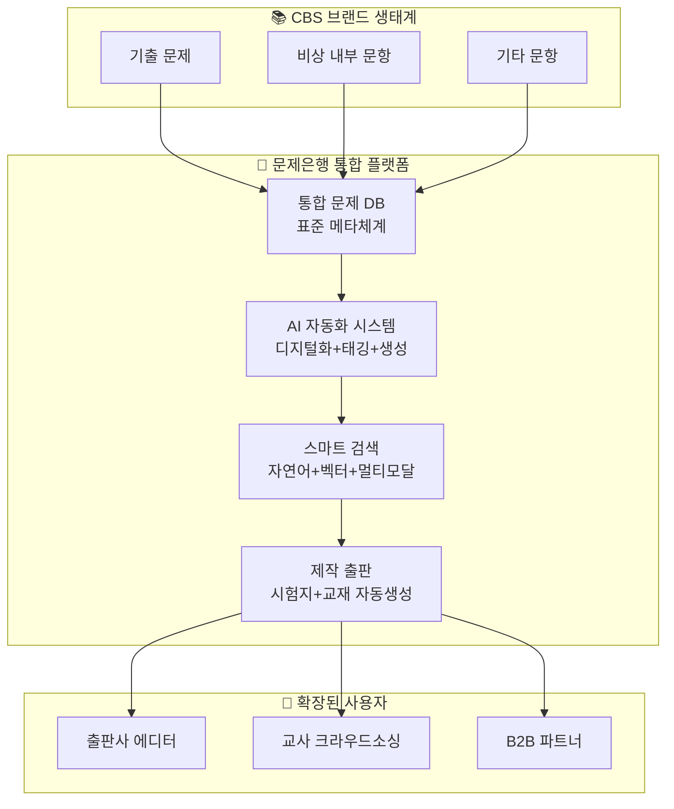
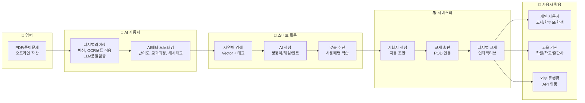

# 🎯 문제은행 플랫폼 - AI 기반 통합 서비스 최종 기획서
> **CBS 통합 모듈 상위기획서 - PT용**  
> 작성일: 2025-09-11  
> 통합 분석: 디지털라이징 + 메타관리 + AI생성 + 스마트검색 + 제작출판

---

## 🚀 **핵심 비전 & 전략적 가치**

### **One-Stop 문제은행 플랫폼**
**"오프라인 문제를 AI로 디지털화하고, CBS 전체가 공유하는 스마트 문제은행"**

### **💡 핵심 플랫폼 가치**
1. **디지털 전환**: 오프라인 자산의 완전한 디지털화
2. **운영 효율화**: AI 자동화로 60-70% 작업 시간 단축 (검증 완료)  
3. **기술 혁신**: 국내 유일 멀티모달 AI 문제은행 플랫폼
4. **CBS 통합**: 모든 브랜드가 활용하는 핵심 인프라

---

## 🏗️ **CBS 통합 구조도**



---

## 🛠️ **5대 핵심 서비스 모듈**

### **1️⃣ 디지털라이징 서비스** `✅ 보유완료`
> **PDF/종이 문제를 AI로 완벽 디지털화**

**핵심 성과**:
- **91-96% 정확도** (멀티모달 LLM 검증완료)
- **20-40배 처리속도 향상** vs 수동작업
- **구조 보존**: 수식/표/그래프 원본 유지

**사용자 편의성**:
- **디지털화**: PDF 업로드 → 자동 변환 완료
- **품질 보장**: AI + 하이브리드 검수 시스템
- **실시간 처리**: 즉시 확인 및 수정 가능

### **2️⃣ 메타관리체계 서비스** `⚡ 확장준비`
> **교육부 표준 기준 AI 자동 태깅**

**2단계 메타구조**:
```yaml
상위 메타데이터 (필수 표준):
  - 교육과정: 2015/2022 개정교육과정
  - 학년/과목: 초1~고3, 전과목
  - 성취기준: 교육부 코드 매핑
  - 출처: 기출문제 상세정보

하위 메타데이터 (검색/추천용):  
  - 개념태그: AI 자동추출
  - 난이도: 5단계 자동분류
  - 문제유형: 선택형/주관식/서술형
  - 성과데이터: 정답률/소요시간/선택패턴
```

### **3️⃣ AI 생성 서비스** `🚀 POC완료`
> **해설/힌트/쌍둥이 문항 AI 자동생성**


🔥 핵심 가치: 수학 교과 한정
  - 쌍둥이 문항 생성 (생성형, 템플릿 형)
  - AI 해설/힌트 자동 생성 (영/수)
  - 무한 확장 가능한 문항 생성

**지원 문제유형**:  
- ✅ **선택형**: 4-5지 객관식
- ✅ **단답형**: 숫자/단어 답안
- ✅ **주관식**: 서술형/논술형
- 🚀 **향후**: 서술형 자동채점

**사용자 경험**:
- **즉시 생성**: 문제 선택 → 클릭 한 번으로 해설/힌트 완성
- **맞춤형 생성**: 난이도별, 학습자 수준별 자동 조절 (추후)
- **품질 보장**: AI 생성 → 전문가 검수 → 사용자 피드백 반영

**기술 구현**:
- **쌍둥이 문항**: 
- 자연어 해설/힌트 


### **4️⃣ 스마트 검색 서비스** `🆕 3단계 구현`
> **"서울 고3 중간고사용 상위권 문제 10개" → 즉시 추천**

**검색 방식별 사용자 경험**:

**1. 자연어 검색**: 
- 입력: "서울 고3 중간고사용 상위권 수학 문제 10개"
- 결과: GPT가 조건을 분석 → 태그 매칭 → 즉시 문제 목록 제공
- 응답시간: 2-3초

**2. 유사문항 검색**:
- 입력: 기존 문제 선택 → "비슷한 문제 찾기" 클릭
- 결과: Vector 유사도 분석 → 개념/구조가 유사한 문제들 추천
- 응답시간: 1-2초

**3. 멀티모달 검색** (향후):
- 입력: 그래프 이미지 업로드 + "이런 그래프 문제"
- 결과: 이미지 + 텍스트 통합 분석 → 관련 문제 추천
- 응답시간: 3-5초

**기술적 구현 단계**:
- Phase 1 : 자연어→태그 변환 시스템
- Phase 2 : Vector DB 하이브리드 검색
- Phase 3 : 멀티모달 통합 검색

### **5️⃣ 제작출판 서비스** `📚 신규핵심`
> **AI가 만드는 시험지/교재 자동생성**

**사용자 워크플로우**:

1. **시험지 자동 생성**:
   - 조건 입력: "중3 1학기 중간고사 60분용" 
   - AI 최적화: 난이도 분포, 시간 배분 자동 계산
   - 즉시 다운로드: PDF/워드 형태로 완성된 시험지 제공

2. **교재 편집 시스템**:
   - 주제 선택: 단원별 문제집 주제 입력
   - AI 편집: 개념설명 → 기본문제 → 응용문제 순서로 자동배치
   - 레이아웃 적용: 폰트, 간격, 이미지 배치 자동 최적화


---

## 🔄 **통합 서비스 파이프라인**[[]]



---


### **🎯 사용자 경험 혁신**
```yaml
기존 방식 vs 새로운 방식:
  문제 찾기:
    기존: 카테고리 탐색 → 태그 필터링 → 수십 개 결과 검토 (10-15분)
    신규: "중3 일차함수 어려운 문제 5개" 입력 → 즉시 결과 (30초)
    
  유사문제:
    기존: 관련 태그 검색 → 수동 비교 → 적합성 판단 (5-10분)
    신규: 기존 문제 선택 → "비슷한 문제" 클릭 → 즉시 추천 (3초)
    
  시험지 제작:
    기존: 문제 선별 → 레이아웃 조정 → 검수 → 수정 (2-3시간)
    신규: 조건 입력 → AI 자동 생성 → 완성본 다운로드 (5분)
```

### **🔧 핵심 기술 스택**
- **AI 엔진**: GPT-4, Claude Sonnet 4 (자연어 처리)
- **Vector DB**: Pinecone, Weaviate (유사도 검색)
- **멀티모달**: CLIP, Vision Transformer (이미지 처리)
- **자동 조판**: InDesign API, LaTeX (문서 생성)


---

## 🎯 **핵심 경쟁우위**

### **기술 우위**
- ✅ **검증된 정확도**: 91-96% (이미 달성)
- 🚀 **멀티모달 AI**: 텍스트+이미지+수식 통합처리
- 🧠 **한국 교육특화**: 한국어/교육과정 최적화

### **비즈니스 우위**
- 📚 **기존자산 활용**: 70% 기존 + 30% 신규개발
- ⚡ **빠른 실행**: MVP 3개월, 완전체 12개월
- 💰 **즉시 ROI**: 구축과 동시에 수익창출

### **시장 우위**  
- 🥇 **First Mover**: 국내 유일 AI 네이티브
- 🏢 **CBS 생태계**: 브랜드간 시너지 극대화
- 🌏 **글로벌 확장**: 한국어 강점 해외진출

---

## 💡 **PRD 작성을 위한 구체적 정의**

### **🎯 핵심 기능 명세**

**1. 자연어 검색 시스템**:
- Input: 사용자가 입력하는 자연어 쿼리 (예: "서울 고3 중간고사용 상위권 문제 10개")
- Processing: GPT-4가 자연어를 구조화된 검색 조건으로 변환
- Output: 조건에 맞는 문제 리스트 + 미리보기
- 성능 요구사항: 응답시간 2-3초, 정확도 80% 이상

**2. 유사문항 추천 시스템**:
- Input: 기준 문제 ID + "비슷한 문제 찾기" 요청
- Processing: Vector 유사도 계산 + 태그 기반 1차 필터링
- Output: 유사도 점수와 함께 정렬된 추천 문제 목록
- 성능 요구사항: 응답시간 1-2초, 추천 정확도 85% 이상

**3. AI 콘텐츠 생성**:
- Input: 문제 ID + 생성할 콘텐츠 유형 (해설/힌트/쌍둥이문항)
- Processing: 문제 분석 → AI 모델 호출 → 품질 검증
- Output: 생성된 콘텐츠 + 신뢰도 점수
- 품질 기준: 교육적 정확성, 적절한 난이도, 논리적 구성

### **📱 사용자 인터페이스 정의**

**검색 인터페이스**:
- 메인 검색창: 자연어 입력 가능한 텍스트 박스
- 고급 필터: 학년/과목/난이도/지역 드롭다운
- 결과 화면: 문제 미리보기 카드 + 메타 정보 표시
- 상세 뷰: 문제 전문 + 해설 + 관련 추천 문제

**생성 도구 인터페이스**:
- 시험지 생성: 위저드 형태 (조건 입력 → 미리보기 → 다운로드)
- 교재 편집: 드래그앤드롭 문제 배치 + 실시간 레이아웃 미리보기
- AI 콘텐츠: 원클릭 생성 버튼 + 결과 편집 가능

### **🗃️ 데이터 구조 정의**

**문제 메타데이터 스키마**:
```yaml
상위_메타데이터:
  교육과정_코드: string (2015/2022 개정)
  학년: integer (1-12)
  과목: string (수학/국어/영어/...)
  성취기준_코드: string (교육부 표준)
  출처: object {시험명, 연도, 지역}

하위_메타데이터:
  개념_태그: array[string]
  난이도: integer (1-5)
  문제_유형: enum [선택형, 단답형, 서술형]
  예상_소요시간: integer (분)
  
성과_데이터:
  정답률: float (0-1)
  평균_소요시간: integer (초)
  선택지_분포: object {A:0.2, B:0.3, C:0.1, D:0.4}
```

**🔧 기술 스펙 정의**

**API 엔드포인트**:
- `POST /search/natural` - 자연어 검색
- `GET /questions/{id}/similar` - 유사문항 추천  
- `POST /generate/explanation` - 해설 생성
- `POST /create/testpaper` - 시험지 생성

**성능 요구사항**:
- 동시 접속자: 1,000명
- 데이터베이스: 100만 문제 처리 가능
- 응답시간: 95% 요청이 3초 이내
- 가용성: 99.9% 업타임

---

**🎯 결론: "기술적 우위와 사용자 경험을 동시에 만족하는 차세대 문제은행 플랫폼"**

---

*본 문서는 094_상위기획 보고문서의 핵심 내용을 통합한 최종 PT용 기획서입니다.*