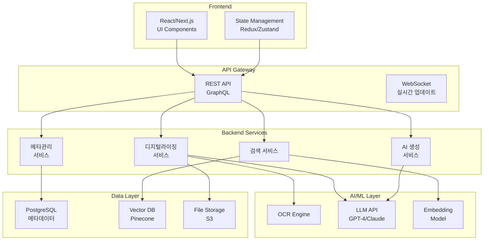

# PRD - 문제은행 플랫폼 상세 명세서
> Product Requirements Document  
> 작성일: 2025-09-11  
> Version: 1.0

---

## 1. **제품 개요**

### 1.1 제품 비전
**"AI 기반 통합 문제은행 플랫폼 - CBS 교육 콘텐츠의 디지털 전환과 지능형 관리"**

### 1.2 목표 사용자
- **1차 사용자**: CBS 내부 에디터 및 콘텐츠 관리자
- **2차 사용자**: 교사, 학원 강사
- **3차 사용자**: 외부 교육 기관 (B2B)

### 1.3 시스템 구성
- **문제풀**: 디지털화된 문항들을 체계적으로 관리하는 공간
- **자료풀**: PDF 원본 파일 및 디지털화 진행 상황을 관리하는 공간
- **기존 디지털라이징 시스템**: https://t-cbs-aitool.vsaidt.com/entry 연동

### 1.4 핵심 가치 제안
- 오프라인 문제의 완벽한 디지털화 (91-96% 정확도)
- AI 기반 자동 태깅 및 메타데이터 관리
- 자연어 검색 및 유사문항 추천
- 원클릭 시험지/교재 자동 생성

---

## 2. **기능 요구사항**

### 2.1 디지털라이징 모듈

#### 2.1.1 파일 업로드
**기능 설명**: PDF/이미지 파일을 업로드하여 디지털 변환

**상세 스펙**:
```yaml
입력:
  - 파일 형식: PDF, JPG, PNG
  - 최대 크기: 100MB
  - 다중 업로드: 최대 10개 동시

처리:
  - OCR 엔진: 박싱 + OCR 모듈
  - LLM 검증: GPT-4 기반 품질 체크
  - 구조 보존: 수식/표/그래프 원본 유지

출력:
  - JSON 구조화 데이터
  - 미리보기 화면
  - 수정 가능한 편집기
```

#### 2.1.2 품질 검증 시스템
**기능 설명**: AI + 사람 하이브리드 검수

**검증 단계**:
1. **자동 검증**: LLM이 OCR 결과 정확도 체크
2. **플래그 표시**: 신뢰도 낮은 부분 하이라이트
3. **수동 검토**: 에디터가 플래그된 부분 확인/수정
4. **최종 승인**: 품질 기준 충족 시 DB 저장

**품질 지표**:
- 텍스트 정확도: 95% 이상
- 수식 정확도: 93% 이상
- 구조 보존율: 100%

### 2.2 메타관리 시스템

#### 2.2.1 자동 태깅
**기능 설명**: AI가 문제 내용을 분석하여 자동으로 태그 생성

**태그 체계**:
```yaml
필수 태그 (상위 메타):
  - 교육과정: [2015개정, 2022개정]
  - 학년: [초1~고3]
  - 과목: [국어, 수학, 영어, 과학, 사회...]
  - 단원: 교육부 표준 단원 코드
  - 성취기준: 교육부 성취기준 코드

자동 생성 태그 (하위 메타):
  - 개념: AI 추출 핵심 개념 (최대 5개)
  - 난이도: [최하, 하, 중, 상, 최상]
  - 예상 소요시간: 분 단위
  - 문제 유형: [선택형, 단답형, 서술형]
```

#### 2.2.2 메타데이터 편집
**기능 설명**: 자동 생성된 태그를 수동으로 수정/추가

**UI 요구사항**:
- 태그 자동완성 기능
- 드래그앤드롭 태그 관리
- 벌크 편집 기능 (다중 선택)
- 태그 히스토리 추적

### 2.3 스마트 검색 시스템

#### 2.3.1 자연어 검색
**기능 설명**: 일상 언어로 문제 검색

**검색 프로세스**:
```python
입력: "서울 고3 중간고사용 상위권 수학 문제 10개"
↓
자연어 파싱 (GPT-4):
{
  "지역": "서울",
  "학년": "고3",
  "시험유형": "중간고사",
  "난이도": "상",
  "과목": "수학",
  "개수": 10
}
↓
쿼리 실행 → 결과 반환
```

**성능 요구사항**:
- 응답 시간: 2-3초
- 검색 정확도: 80% 이상
- 동시 검색: 100건/초

#### 2.3.2 유사문항 검색
**기능 설명**: Vector DB 기반 의미적 유사도 검색

**기술 구현**:
```yaml
임베딩 모델: text-embedding-3-small
벡터 차원: 768
유사도 계산: Cosine Similarity
Vector DB: Pinecone

검색 플로우:
  1. 기준 문제 → 벡터 변환
  2. Vector DB에서 유사 벡터 검색
  3. 유사도 점수 기준 정렬
  4. 상위 N개 반환
```

#### 2.3.3 멀티모달 검색 (Phase 3)
**기능 설명**: 이미지 + 텍스트 통합 검색

**지원 기능**:
- 그래프 이미지로 유사 문제 검색
- 수식 이미지로 관련 문제 찾기
- 텍스트 + 이미지 복합 쿼리

### 2.4 AI 생성 시스템

#### 2.4.1 문항 기반 통합 생성
**기능 설명**: 개별 문항에서 AI 콘텐츠를 통합적으로 생성

**생성 방식**:
- **개별 생성**: 문제 상세보기에서 개별 문항에 대해 해설/힌트/쌍둥이 문항 생성
- **일괄 생성**: 여러 문항을 선택하여 일괄적으로 AI 콘텐츠 생성

#### 2.4.2 PDF 기반 통합 생성
**기능 설명**: 디지털라이징 완료된 PDF에서 추출된 모든 문제에 대한 일괄 생성

**워크플로우**:
```yaml
PDF 업로드 → OCR/디지털화 → 문항 추출 → AI 콘텐츠 일괄 생성
```

#### 2.4.3 생성 콘텐츠 유형
**해설 생성**:
- 난이도별 해설 (기본/상세/전문가)
- 단계별 풀이 과정
- 핵심 개념 설명 포함

**힌트 생성**:
- Level 1: 방향 제시
- Level 2: 공식 힌트  
- Level 3: 부분 풀이

**쌍둥이 문항 생성**:
- 숫자 변경형: 동일 구조, 다른 값
- 상황 변경형: 동일 개념, 다른 맥락
- 난이도 조절형: 단계별 변형

### 2.5 문제풀/자료풀 관리 시스템

#### 2.5.1 문제풀 관리
**기능 설명**: 디지털화된 문항들의 체계적 관리

**관리 기능**:
- 문제 분류 및 필터링 (객관식/주관식/서술형)
- 과목별/난이도별 분류
- 문항별 상세 정보 표시
- 개별/일괄 AI 생성 기능

#### 2.5.2 자료풀 관리
**기능 설명**: PDF 원본 파일 및 디지털화 진행 상황 관리

**관리 기능**:
- PDF 파일 업로드 및 상태 관리
- 디지털라이징 진행률 실시간 모니터링
- 완료된 파일에서 문항 추출 결과 확인
- 외부 디지털라이징 시스템 연동

#### 2.5.3 기존 시스템 연동
**연동 대상**: https://t-cbs-aitool.vsaidt.com/entry

**연동 방식**:
- 자료풀에서 디지털라이징 시스템으로 직접 연결
- 처리 상태 실시간 동기화
- 완료된 결과물 자동 가져오기

---

## 3. **사용자 인터페이스**

### 3.1 메인 대시보드

```
┌─────────────────────────────────────────────────────┐
│  📚 CBS 문제은행                      [👤] [⚙️] [?]  │
├─────────────────────────────────────────────────────┤
│                                                      │
│  ┌────────────────────────────────────────────┐    │
│  │ 🔍 "중3 일차함수 문제" 검색하기...         │    │
│  └────────────────────────────────────────────┘    │
│                                                      │
│  [📤 파일 업로드]  [📝 시험지 생성]  [📖 교재 만들기] │
│                                                      │
│  ┌─────────┬─────────┬─────────┬─────────┐       │
│  │ 최근작업 │ 내문제함 │ 공유함  │ 휴지통  │       │
│  └─────────┴─────────┴─────────┴─────────┘       │
│                                                      │
│  📊 오늘의 통계                                     │
│  • 디지털화: 1,245 문제                            │
│  • 생성된 시험지: 32개                             │
│  • 활성 사용자: 156명                              │
└─────────────────────────────────────────────────────┘
```

### 3.2 디지털라이징 화면

```
┌─────────────────────────────────────────────────────┐
│  📄 디지털라이징                          [1차/2차]  │
├─────────────────────────────────────────────────────┤
│                                                      │
│  ┌─────────────┬──────────────┬─────────────┐     │
│  │ 1️⃣ Boxing   │ 2️⃣ OCR      │ 3️⃣ 검증    │     │
│  │    ✅       │     🔄       │     ⏸️      │     │
│  └─────────────┴──────────────┴─────────────┘     │
│                                                      │
│  ┌──────────────────┬────────────────────────┐     │
│  │                  │  📝 OCR 결과            │     │
│  │  [PDF 미리보기]  │  ┌──────────────────┐  │     │
│  │                  │  │ 문제 1번          │  │     │
│  │  ┌────────────┐ │  │ 발문: ...        │  │     │
│  │  │            │ │  │ 선택지:          │  │     │
│  │  │   문제     │ │  │  1) ...          │  │     │
│  │  │   이미지   │ │  │  2) ...          │  │     │
│  │  │            │ │  │                  │  │     │
│  │  └────────────┘ │  │ 🟡 신뢰도: 94%   │  │     │
│  │                  │  └──────────────────┘  │     │
│  └──────────────────┴────────────────────────┘     │
│                                                      │
│  [이전] [다음]  [수정] [승인]  [전체 다운로드]      │
└─────────────────────────────────────────────────────┘
```

### 3.3 검색 결과 화면

```
┌─────────────────────────────────────────────────────┐
│  🔍 검색 결과: "중3 일차함수"           234개 결과   │
├─────────────────────────────────────────────────────┤
│                                                      │
│  필터: [학년 ▼] [과목 ▼] [난이도 ▼] [유형 ▼]      │
│                                                      │
│  ┌──────────────────────────────────────────┐      │
│  │ □ 📄 문제 ID: Q2023-0912                 │      │
│  │    중3 | 수학 | 일차함수 | 난이도: 중    │      │
│  │    ─────────────────────────────────     │      │
│  │    다음 일차함수의 그래프가...            │      │
│  │    [미리보기]                             │      │
│  │                                           │      │
│  │    🏷️ 태그: #일차함수 #그래프 #기울기     │      │
│  │    📊 정답률: 67% | ⏱️ 평균: 3분          │      │
│  │                                           │      │
│  │    [선택] [유사문제] [해설생성] [시험지추가]│     │
│  └──────────────────────────────────────────┘      │
│                                                      │
│  [더 보기...]                                        │
└─────────────────────────────────────────────────────┘
```

### 3.4 시험지 생성 위저드

```
┌─────────────────────────────────────────────────────┐
│  📝 시험지 생성 위저드              [1/4 단계]       │
├─────────────────────────────────────────────────────┤
│                                                      │
│  1️⃣ 기본 정보 설정                                  │
│                                                      │
│  시험명: [2024 1학기 중간고사        ]              │
│  학교/학원: [○○중학교               ]              │
│  학년: [중3 ▼]  과목: [수학 ▼]                     │
│  시험 시간: (●) 50분 ( ) 100분 ( ) 기타:[  ]       │
│                                                      │
│  2️⃣ 문제 구성                                       │
│                                                      │
│  총 문항 수: [25] 문제                              │
│  객관식: [20] 문제 (각 4점)                         │
│  주관식: [5] 문제 (각 5점)                          │
│                                                      │
│  난이도 분포:                                        │
│  하 [■■□□□] 20%                                  │
│  중 [■■■■□] 60%                                  │
│  상 [■□□□□] 20%                                  │
│                                                      │
│           [취소]  [이전]  [다음 →]                  │
└─────────────────────────────────────────────────────┘
```

---

## 4. **기술 사양**

### 4.1 시스템 아키텍처



### 4.2 API 명세

#### 4.2.1 디지털라이징 API
```yaml
POST /api/digitalize/upload
  Request:
    - file: multipart/form-data
    - options: {auto_tag: boolean, quality_check: boolean}
  Response:
    - job_id: string
    - status: "processing"
    
GET /api/digitalize/status/{job_id}
  Response:
    - status: "completed" | "processing" | "failed"
    - result: {questions: [...], confidence: 0.96}
```

#### 4.2.2 검색 API
```yaml
POST /api/search/natural
  Request:
    - query: "중3 일차함수 어려운 문제"
    - limit: 10
  Response:
    - results: [{id, title, tags, score}...]
    - total: 234
    
GET /api/search/similar/{question_id}
  Request:
    - limit: 5
  Response:
    - similar_questions: [{id, similarity_score}...]
```

#### 4.2.3 생성 API
```yaml
POST /api/generate/explanation
  Request:
    - question_id: string
    - level: "basic" | "intermediate" | "advanced"
  Response:
    - explanation: string
    - confidence: 0.92
    
POST /api/generate/test-paper
  Request:
    - conditions: {grade, subject, duration, difficulty}
  Response:
    - test_paper_id: string
    - preview_url: string
```

### 4.3 성능 요구사항

```yaml
응답 시간:
  - 검색: < 3초 (95 percentile)
  - 파일 업로드: < 5초/MB
  - AI 생성: < 10초
  
처리 용량:
  - 동시 사용자: 1,000명
  - 일일 처리량: 10,000 문제
  - 저장 용량: 100만 문제
  
가용성:
  - 업타임: 99.9%
  - 백업: 일 1회
  - 복구 시간: < 4시간
```

---

## 5. **보안 및 권한**

### 5.1 사용자 권한
```yaml
관리자:
  - 모든 기능 접근
  - 사용자 관리
  - 시스템 설정
  
에디터:
  - 파일 업로드/편집
  - 메타데이터 수정
  - 시험지/교재 생성
  
일반 사용자:
  - 검색/열람
  - 개인 문제함 관리
  - 제한적 생성 기능
```

### 5.2 데이터 보안
- 전송 암호화: TLS 1.3
- 저장 암호화: AES-256
- 접근 로그: 모든 활동 기록
- 개인정보: GDPR/KISA 준수

---

## 6. **배포 및 운영**

### 6.1 배포 단계
```yaml
Phase 1 (3개월):
  - 디지털라이징 모듈
  - 기본 검색 기능
  - 메타데이터 관리
  
Phase 2 (6개월):
  - Vector DB 검색
  - AI 생성 기능
  - 시험지 생성
  
Phase 3 (12개월):
  - 멀티모달 검색
  - 고급 AI 기능
  - B2B API 오픈
```

### 6.2 모니터링
- 실시간 대시보드: Grafana
- 로그 수집: ELK Stack
- APM: DataDog
- 알림: Slack/Email

---

## 7. **성공 지표 (KPI)**

```yaml
기술 지표:
  - OCR 정확도: > 95%
  - 검색 정확도: > 85%
  - 시스템 가용성: > 99.9%
  
사용자 지표:
  - 일일 활성 사용자: > 500명
  - 문제 등록량: > 1,000개/일
  - 검색 만족도: > 4.5/5.0
  
비즈니스 지표:
  - 처리 시간 단축: 60%
  - 운영 비용 절감: 40%
  - 콘텐츠 재사용률: 80%
```

---

*본 PRD는 문제은행 플랫폼의 상세 기능 명세를 담은 제품 요구사항 문서입니다.*